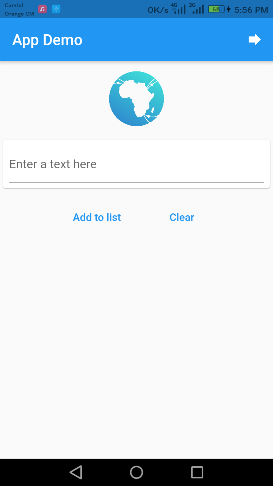
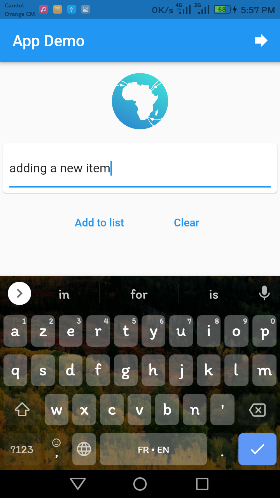
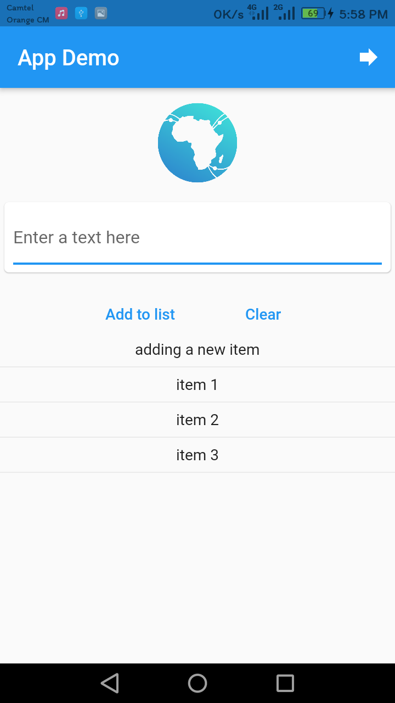

# zuri_training_task2

## app for the second task of zuri intership

### The hello script is written in python, there in the root folder

### here are some screenshots:

### first is the main screen, where you add inputs to the list, and when you tap on add to list it will be displayed below

### and here is the second screen, it contains just some images and the link to the website

